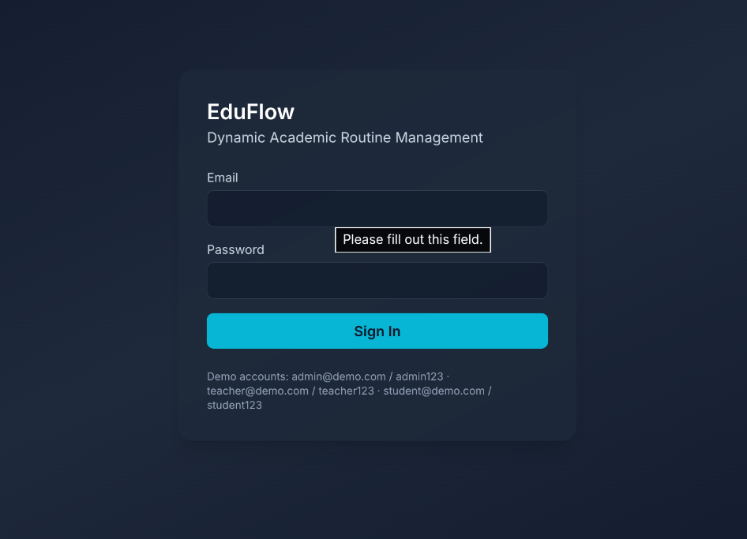
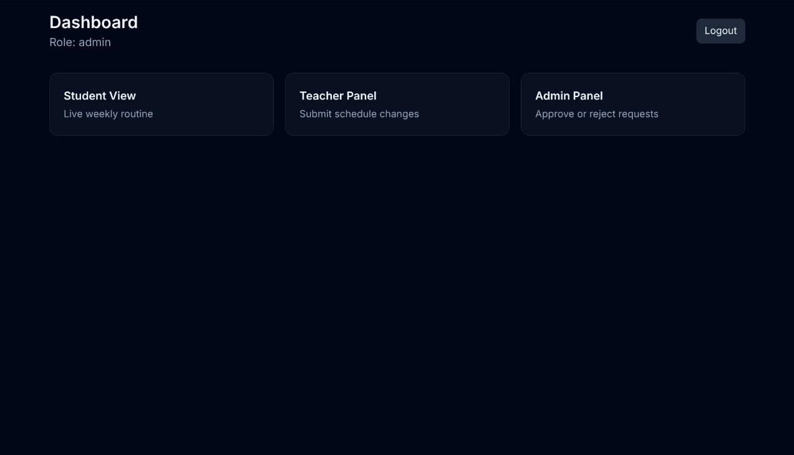
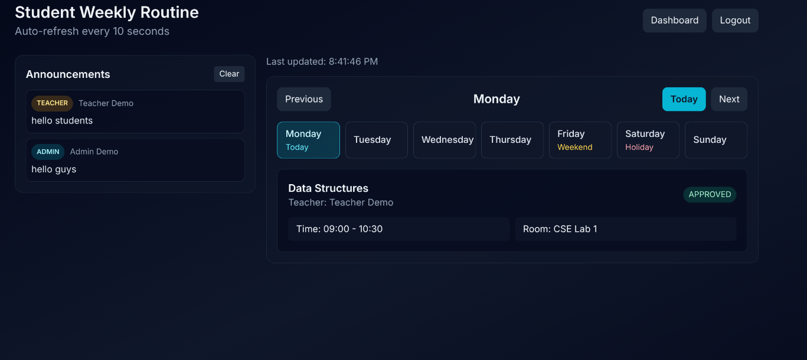
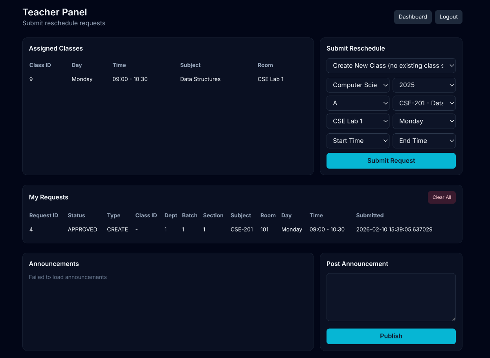
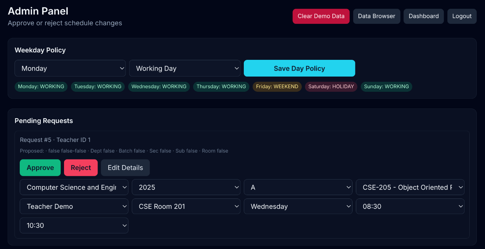
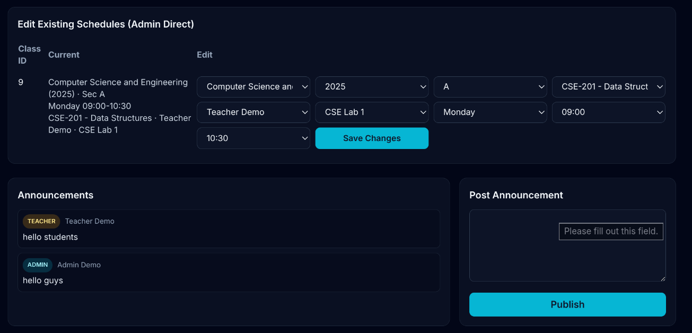
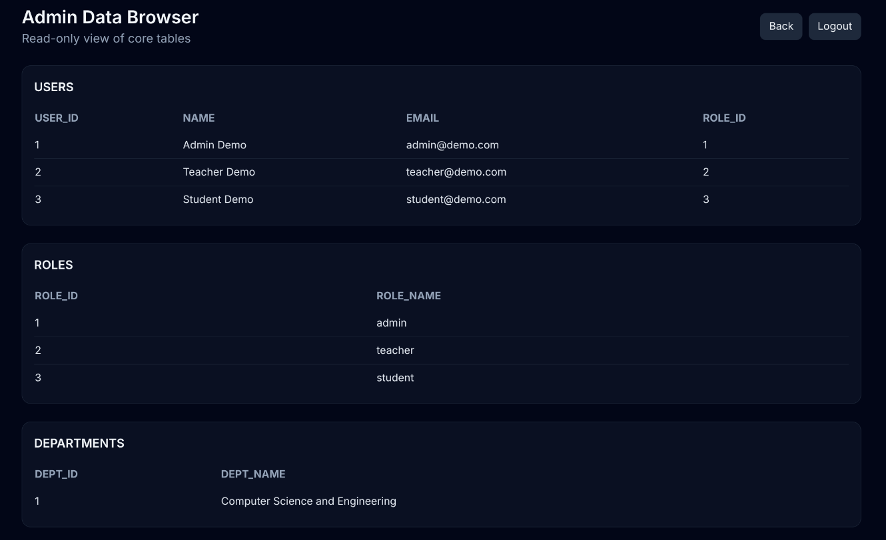
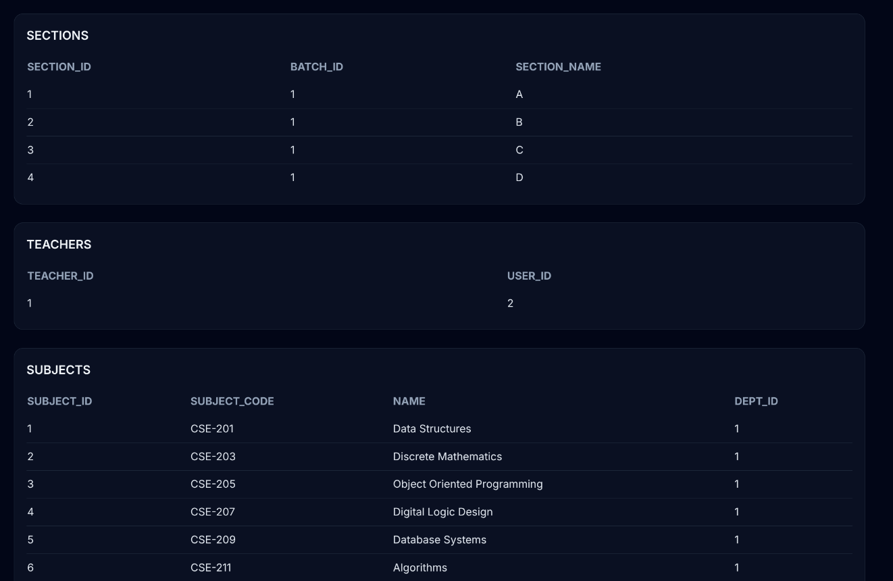
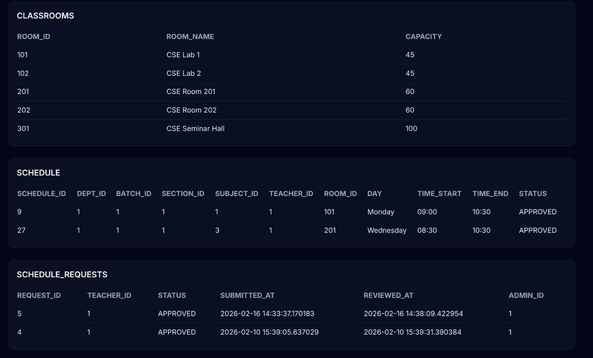
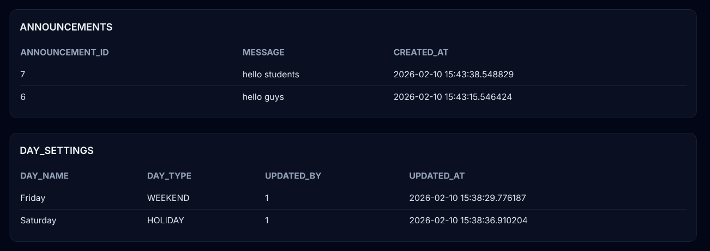

# EduFlow

EduFlow is a role-based academic routine management system built with JSP, Servlets, Oracle DB, Apache Ant, and Tomcat.

## Project Goal

EduFlow manages academic class routines with controlled workflow:

- Students can view approved schedules.
- Teachers can create new class requests and submit edits for existing classes.
- Admin reviews requests, approves/rejects them, and can also edit schedules directly.
- Conflict rules prevent overlapping classes, room clashes, and teacher double-booking.

## Feature Highlights

- Role-based authentication (`admin`, `teacher`, `student`)
- Teacher request workflow: create new requests and update requests for assigned classes
- Admin approval workflow: approve/reject and directly edit approved schedules
- Conflict checks: student overlap, room clash, teacher availability
- Day policy: `WORKING`, `WEEKEND`, `HOLIDAY`
- Auto cleanup: setting day to weekend/holiday removes approved classes for that day
- Announcements: posted by admin/teacher, visible to all roles with sender chip
- Admin data browser page for table inspection

## UI Screenshots

Screenshots are stored in `Screenshots/`.

### Login Page



### Dashboard



### Student View



### Teacher View



### Admin View




### Admin Data Browser






## Tech Stack

- Java 17+
- JSP + Jakarta Servlets (Tomcat 10)
- Oracle XE (Docker)
- Apache Ant
- Tailwind CSS CDN + vanilla JavaScript

## Project Structure

```text
EduFlow/
├── build.xml
├── config.properties
├── database/
│   ├── schema.sql
│   └── seed.sql
├── lib/
│   └── ojdbc.jar   (you add manually)
├── scripts/
│   ├── setup.sh
│   └── setup.ps1
├── run_eduflow.sh
├── run_eduflow.ps1
├── src/com/eduflow/
│   ├── dao/
│   ├── model/
│   ├── servlet/
│   └── util/
└── web/
    ├── *.jsp
    └── WEB-INF/web.xml
```

## 1) Prerequisites (Install First)

Install these before running launcher scripts.

- Git: https://git-scm.com/downloads
- Java JDK 17+: https://adoptium.net/temurin/releases/
- Apache Ant: https://ant.apache.org/bindownload.cgi
- Docker Desktop / Docker Engine: https://www.docker.com/products/docker-desktop/
- Apache Tomcat 10.x: https://tomcat.apache.org/download-10.cgi
- Oracle JDBC driver (`ojdbc.jar`): https://www.oracle.com/database/technologies/appdev/jdbc-downloads.html

Oracle DB note:

- You do **not** need to install Oracle manually if using Docker.
- This project uses image `gvenzl/oracle-xe:21-slim`:
  https://hub.docker.com/r/gvenzl/oracle-xe

## 2) Clone and Prepare Project

```bash
git clone <YOUR_REPO_URL>
cd EduFlow
```

Place JDBC jar in `lib/` and rename exactly to:

```text
lib/ojdbc.jar
```

## 3) Set `CATALINA_HOME`

### Linux/macOS

```bash
export CATALINA_HOME="$HOME/tomcat"
```

(Adjust path to your Tomcat folder.)

### Windows PowerShell

```powershell
setx CATALINA_HOME "C:\path\to\apache-tomcat-10.x.x"
```

Open a new terminal after `setx`.

## 4) Run One-Command Launcher (Recommended)

### Linux/macOS

```bash
chmod +x run_eduflow.sh
./run_eduflow.sh
```

### Windows PowerShell

```powershell
powershell -ExecutionPolicy Bypass -File .\run_eduflow.ps1
```

What these launchers do:

- verify prerequisites (`java`, `ant`, `docker`, etc.)
- verify/add Tomcat path checks
- start Oracle XE container (compose or fallback mode)
- wait for DB readiness using `sqlplus` probe
- apply `schema.sql` + `seed.sql` only if DB not initialized
- build WAR with Ant
- deploy WAR to Tomcat and restart Tomcat

Open app:

```text
http://localhost:8080/EduFlow/login.jsp
```

## 5) Demo Credentials

- Admin: `admin@demo.com` / `admin123`
- Teacher: `teacher@demo.com` / `teacher123`
- Student: `student@demo.com` / `student123`

## 6) Optional Controls

Force DB re-initialization (re-apply schema/seed):

### Linux/macOS

```bash
FORCE_DB_INIT=1 ./run_eduflow.sh
```

### Windows PowerShell

```powershell
$env:FORCE_DB_INIT="1"
powershell -ExecutionPolicy Bypass -File .\run_eduflow.ps1
```

## 7) Manual Build/Deploy (If Needed)

```bash
ant clean compile dist
```

Then deploy `dist/EduFlow.war` to Tomcat `webapps/` and restart Tomcat.

## 8) Troubleshooting

- `Missing lib/ojdbc.jar`: ensure file exists exactly at `lib/ojdbc.jar`
- Docker not reachable: start Docker Desktop/daemon
- `CATALINA_HOME` not set/found: set correct Tomcat path
- Oracle readiness timeout: inspect container logs
  - `docker logs oraclexe`
- Permission error deploying WAR:
  - Linux script retries with `sudo`
  - Windows script retries elevated when needed

## License

This project is licensed under the license defined in this repository.
